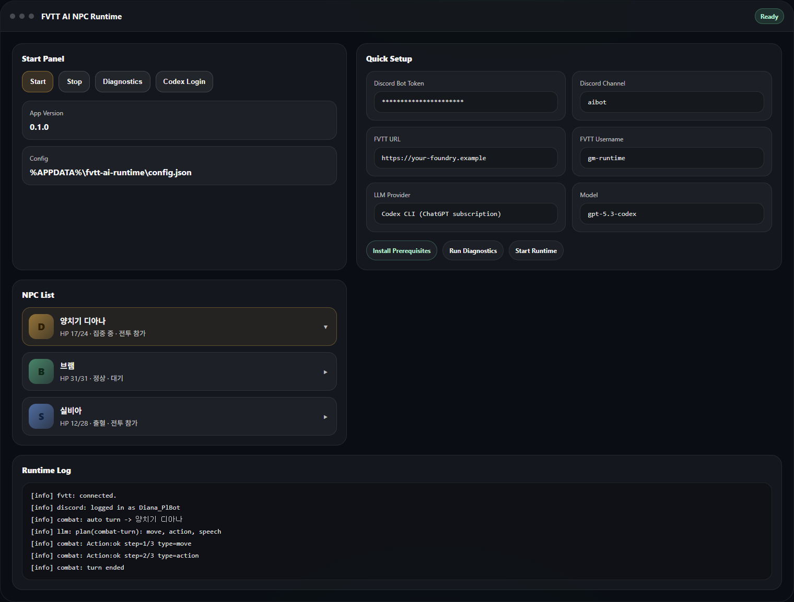
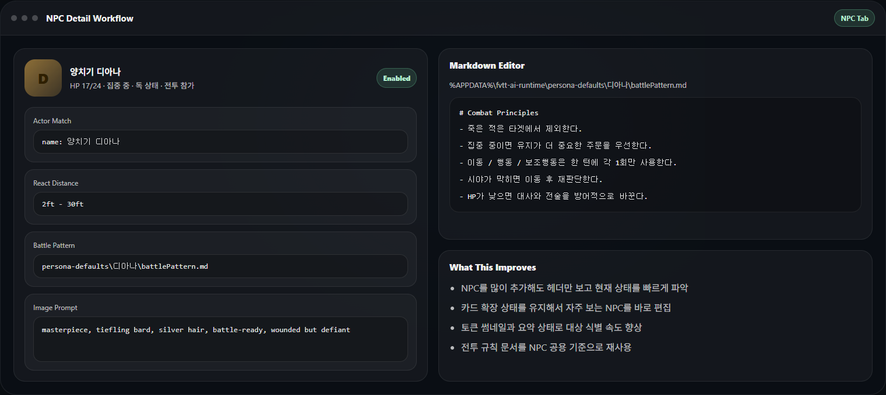

# FVTT AI NPC Runtime 5분 시작 가이드

이 문서는 소스 빌드 없이 `Windows 설치형 EXE`만 받아 실행하는 사용자를 기준으로 작성되었습니다.

## 이 문서가 필요한 사람

- GitHub 저장소를 처음 열어본 사용자
- EXE를 받아 바로 실행하고 싶은 사용자
- FVTT, Discord, Codex 연결 순서를 짧게 확인하고 싶은 사용자

## 먼저 준비할 것

실행 전에 아래 정보만 준비하면 됩니다.

1. `Foundry VTT`
   - 접속 URL
   - 계정 ID
   - 비밀번호
2. `Discord`
   - Bot Token
   - 사용할 채널 이름
3. `LLM`
   - 권장: `Codex CLI (ChatGPT subscription)`
4. `선택 사항`
   - Stable Diffusion WebUI URL
   - NPC용 Markdown 문서

## 1. 설치

1. 배포된 설치 파일 `FVTT AI NPC Runtime Setup 0.1.0.exe`를 실행합니다.
2. 설치가 끝나면 시작 메뉴에서 `FVTT AI NPC Runtime`을 실행합니다.

## 2. 메인 화면에서 할 일

처음 실행 후에는 아래 버튼만 기억하면 됩니다.

- `Install Prerequisites`: Codex / Node 등 선행 조건 설치
- `Codex Login`: Codex 로그인
- `Diagnostics`: Discord / FVTT / LLM 연결 점검
- `Start`: 실제 런타임 시작

## 3. Quick Setup 입력

`기본 설정 > Runtime` 탭에서 아래 값을 입력합니다.

- `Discord Bot Token`
- `Discord Channel`
- `FVTT URL`
- `FVTT Username`
- `FVTT Password`
- `LLM Provider`

권장값:

- `LLM Provider = Codex CLI (ChatGPT subscription)`
- 모델은 기본값 유지
- 이미지 생성이 필요 없으면 Image 탭은 비워도 됩니다

## 4. 필수 버튼 순서

처음 한 번은 아래 순서대로 진행하는 것이 가장 안전합니다.

1. `Install Prerequisites`
2. `Codex Login`
3. `Save Quick Setup`
4. `Diagnostics`
5. `Start`

`Diagnostics`에서 최소한 아래 3개가 `ok`여야 합니다.

- `discord`
- `fvtt`
- `llm`

## 5. NPC 설정

`NPC 설정` 탭에서는 NPC별 설정을 관리합니다.

- `Add NPC`로 NPC 추가
- 카드 헤더에서 이름과 토큰 썸네일 확인
- 클릭하면 카드가 펼쳐져 상세 설정 편집
- `Foundry Actor` 연결
- `Soul` / `Battle Rule` / `World Lore` Markdown 연결
- `React Distance` 설정
- `Save NPC`로 개별 저장

기본적으로 카드 상태는 접혀 있고, 펼침 상태는 저장됩니다.

## 6. 처음 성공 기준

아래까지 되면 기본 연결은 정상입니다.

1. `Start` 후 로그에 오류가 없음
2. Discord 채널에서 NPC 호출 시 응답
3. FVTT에서 NPC 토큰 썸네일이 보임
4. 전투 시작 후 NPC 턴에 자동 행동
5. 행동 종료 후 턴이 자동으로 넘어감

## 7. 전투에서 자동으로 보는 정보

이 런타임은 전투 중 아래 요소를 읽고 행동을 제한합니다.

- 이동력
- 액션 / 보조 행동
- 주문 슬롯
- 현재 HP
- 집중 여부
- 상태이상 / 효과
- 전투 참여 여부
- 시야, 벽, 경로 가능 여부
- dead / HP 0 / 사망 유사 상태

예를 들어 `소검 공격`과 `잔혹한 모욕`이 둘 다 액션이면, 일반적인 상황에서는 한 턴에 둘 다 쓰지 않도록 판단합니다.

## 8. 자주 막히는 지점

### Codex Login이 실패할 때

- `Install Prerequisites`를 먼저 실행합니다.
- 로그인 창이 열리면 그 창에서 직접 로그인을 마칩니다.
- 완료 후 다시 `Diagnostics`를 돌립니다.

### FVTT 연결이 실패할 때

- URL이 정확한지 확인합니다.
- 해당 계정이 Actor/Token에 `Owner` 권한이 있는지 확인합니다.
- Scene에 실제 토큰이 배치되어 있는지 확인합니다.

### NPC 토큰 썸네일이 안 뜰 때

- `Start` 후 `Refresh Tokens`를 눌러 다시 동기화합니다.
- Actor 연결이 정확한지 확인합니다.

### 전투 행동이 예상과 다를 때

- NPC의 `Battle Rule` 문서를 먼저 확인합니다.
- `Enable full trace log`를 켜고 실제 입력/출력을 점검합니다.

## 9. 설정 파일 위치

기본 설정 파일 경로:

- `%APPDATA%\\fvtt-ai-runtime\\config.json`

이 파일에는 Discord / FVTT / LLM 설정이 저장됩니다.

## 10. 다음에 읽을 문서

- 제품 소개: `README.md`
- 배포 준비: `RELEASE_GUIDE_KR.md`
- 변경 내역: `CHANGELOG.md`
- 내부 설계 메모: `Spec.md`
