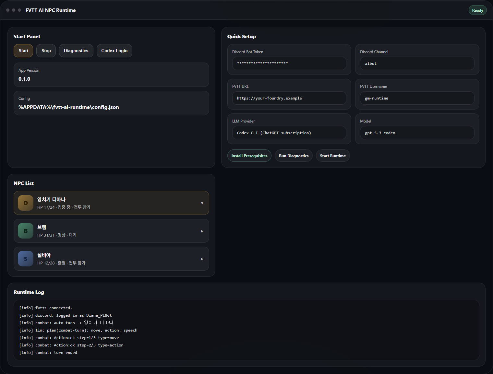
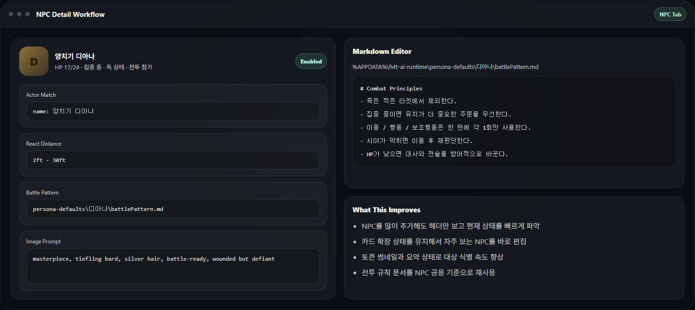

# FVTT AI NPC Runtime 5분 시작 가이드

이 문서는 소스 빌드 없이 `Windows 설치형 EXE`만 받아 실행하는 사용자를 기준으로 작성되었습니다.

## 이 문서가 필요한 사람

- GitHub 저장소를 처음 열어본 사용자
- EXE를 받아 바로 실행하고 싶은 사용자
- FVTT, Discord, Codex 연결 순서를 짧게 확인하고 싶은 사용자
- 전투뿐 아니라 소셜 연기까지 바로 켜 보고 싶은 DM

## 먼저 준비할 것

실행 전에 아래 정보만 준비하면 됩니다.

1. `Foundry VTT`
   - 접속 URL
   - 계정 ID
   - 비밀번호
2. `Discord`
   - Bot Token
   - 사용할 채널 이름
3. `LLM`
   - 권장: `Codex CLI (ChatGPT subscription)`
4. `선택 사항`
   - Stable Diffusion WebUI URL
   - NPC용 Markdown 문서
   - 추가 FVTT 세션 정보
   - 맵별 social preset JSON

## 1. 설치

1. 배포된 설치 파일 `FVTT AI NPC Runtime Setup 0.1.0.exe`를 실행합니다.
2. 설치가 끝나면 시작 메뉴에서 `FVTT AI NPC Runtime`을 실행합니다.

## 2. 메인 화면에서 기억할 버튼



처음 실행 후에는 아래 버튼만 기억하면 됩니다.

- `Install Prerequisites`
- `Codex Login`
- `Diagnostics`
- `Start`
- `Save Quick Setup`
- `Save Social`

## 3. Quick Setup 입력

`기본 설정 > Runtime` 탭에서 아래 값을 입력합니다.

- `Discord Bot Token`
- `Discord Channel`
- `FVTT URL`
- `FVTT Username`
- `FVTT Password`
- `Default FVTT Session ID`
- `LLM Provider`

필요하면 아래도 같이 넣습니다.

- `Extra FVTT Sessions (JSON array)`
- `OpenAI API Key`
- `Codex CLI Path`

권장값:

- `LLM Provider = Codex CLI (ChatGPT subscription)`
- 모델은 기본값 유지
- 이미지 생성이 필요 없으면 Image 탭은 비워도 됩니다

### 추가 FVTT 세션 예시

```json
[
  {
    "id": "absent-player-1",
    "label": "Absent Player 1",
    "username": "player1",
    "password": "secret",
    "userId": "",
    "autoConnect": true
  }
]
```

이 값은 결석 플레이어 대행, 동료 NPC 소유권 분리, 계정별 Owner 분리를 위해 사용합니다.

## 4. NPC 설정



`NPC 설정` 탭에서는 NPC별 기본값을 관리합니다.

- `Add NPC`로 NPC 추가
- 카드 헤더에서 이름과 토큰 썸네일 확인
- 클릭하면 카드가 펼쳐져 상세 설정 편집
- `Foundry Actor` 연결
- `Soul` / `Battle Rule` / `World Lore` Markdown 연결
- `React Distance` 설정
- 필요 시 `FVTT Ownership / Session` 지정
- `Director Settings`에서 social weight나 override 조정
- `Save NPC`로 개별 저장

기본적으로 카드 상태는 접혀 있고, 펼침 상태는 저장됩니다.

## 5. 소셜 연기 탭 설정

`소셜 연기` 탭에서 비전투 장면 준비를 합니다.

### 최소 권장 세팅

- `Enable social director` 켜기
- `Director Mode = Nearby` 또는 `Directed`
- `Enable ambient chatter` 필요 시 켜기
- `Current World Setup`에 현재 장면 메모 입력

예시:

```text
@Barkeep: polishing mugs and listening for rumors
@Town Guard: checking the tavern door and watching late arrivals
The tavern is tense after sundown.
```

### Scene Preset 만들기

1. 현재 소셜 설정을 채웁니다.
2. `Preset Label`, `Scene ID Match` 또는 `Scene Name Match`를 입력합니다.
3. `Capture Current`를 누릅니다.
4. 필요하면 `Export Preset`으로 JSON 저장합니다.

### Scene Preset 불러오기

- 다른 PC나 다른 월드에서 같은 준비를 쓰려면 `Import Preset`
- 현재 화면에 즉시 반영만 하려면 `Apply Preset`
- 실제 런타임에서는 Scene ID 우선, Scene Name 차선으로 자동 적용

## 6. 필수 버튼 순서

처음 한 번은 아래 순서대로 진행하는 것이 가장 안전합니다.

1. `Install Prerequisites`
2. `Codex Login`
3. `Save Quick Setup`
4. `Save NPC`
5. `Save Social`
6. `Diagnostics`
7. `Start`

`Diagnostics`에서 최소한 아래 3개가 `ok`여야 합니다.

- `discord`
- `fvtt`
- `llm`

## 7. 처음 성공 기준

아래까지 되면 기본 연결은 정상입니다.

1. `Start` 후 로그에 오류가 없음
2. Discord 채널에서 NPC 호출 시 응답
3. FVTT에서 NPC 토큰 썸네일이 보임
4. 전투 시작 후 NPC 턴에 자동 행동
5. `소셜 연기` 탭이 켜져 있으면 플레이어 근처에서 짧은 소셜 반응이 나옴
6. 현재 맵이 preset과 일치하면 world activity와 social 설정이 자동 반영됨

## 8. 전투에서 자동으로 보는 정보

이 런타임은 전투 중 아래 요소를 읽고 행동을 제한합니다.

- 이동력
- 액션 / 보조 행동
- 주문 슬롯
- 현재 HP
- 집중 여부
- 상태이상 / 효과
- 전투 참여 여부
- 시야, 벽, 경로 가능 여부
- dead / HP 0 / 사망 유사 상태

예를 들어 `소검 공격`과 `잔혹한 모욕`이 둘 다 액션이면, 일반적인 상황에서는 한 턴에 둘 다 쓰지 않도록 판단합니다.

## 9. 자주 막히는 지점

### Codex Login이 실패할 때

- `Install Prerequisites`를 먼저 실행합니다.
- 로그인 창이 열리면 그 창에서 직접 로그인을 마칩니다.
- 완료 후 다시 `Diagnostics`를 돌립니다.

### FVTT 연결이 실패할 때

- URL이 정확한지 확인합니다.
- 해당 계정이 Actor/Token에 `Owner` 권한이 있는지 확인합니다.
- Scene에 실제 토큰이 배치되어 있는지 확인합니다.

### 소셜 연기가 안 나올 때

- `Enable social director` 또는 `Enable ambient chatter`가 실제로 켜져 있는지 확인합니다.
- `Director Mode`가 `Off`로 남아 있지 않은지 확인합니다.
- `Current World Setup`이 `@NPC 이름: 내용` 형식을 지키는지 확인합니다.
- Scene Preset을 가져왔다면 `Apply Preset` 또는 자동 scene match가 적용됐는지 확인합니다.
- NPC 카드의 `Director Settings` override가 글로벌 설정을 덮어쓰지 않는지 확인합니다.

### preset 자동 적용이 안 될 때

- `Scene ID Match`가 실제 Foundry Scene ID와 같은지 확인합니다.
- Scene ID를 비워 두었다면 `Scene Name Match`가 실제 씬 이름과 같은지 확인합니다.
- 비슷한 이름의 preset이 여러 개 있으면 라벨보다 ID/Name 일치가 우선입니다.

### 다중 FVTT 세션이 꼬일 때

- `Default FVTT Session ID`가 비어 있지 않은지 확인합니다.
- `Extra FVTT Sessions`의 JSON 문법이 맞는지 확인합니다.
- NPC 카드의 `FVTT Ownership / Session`이 존재하는 세션 ID를 가리키는지 확인합니다.
- 결석 플레이어 대행용 계정이 실제로 해당 Actor/Token을 조작할 수 있는지 확인합니다.

### NPC 토큰 썸네일이 안 뜰 때

- `Start` 후 `Refresh Tokens`를 눌러 다시 동기화합니다.
- Actor 연결이 정확한지 확인합니다.

### 전투 행동이 예상과 다를 때

- NPC의 `Battle Rule` 문서를 먼저 확인합니다.
- `Enable full trace log`를 켜고 실제 입력/출력을 점검합니다.

## 10. 설정 파일 위치

기본 설정 파일 경로:

- `%APPDATA%\\fvtt-ai-runtime\\config.json`

이 파일에는 Discord / FVTT / LLM / social preset 관련 정보가 저장됩니다.

## 11. 다음에 읽을 문서

- 제품 소개: `README.md`
- 배포 준비: `RELEASE_GUIDE_KR.md`
- 변경 내역: `CHANGELOG.md`
- 내부 설계 메모: `Spec.md`
