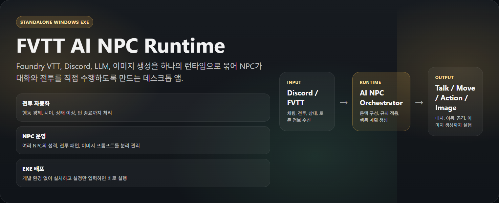

# FVTT AI NPC Runtime

FVTT 전투와 Discord 대화를 AI NPC가 스스로 처리하도록 연결해 주는 Windows 데스크톱 런타임입니다.  
소스코드 세팅 없이 `exe`만 받아 실행하는 사용자를 기준으로 설계되었습니다.

## 문서 바로가기

- 출시용 런치 킷: `docs/release/LAUNCH_KIT_KR.md`
- 5분 실행 가이드: `QUICKSTART_KR.md`
- 배포 체크리스트: `RELEASE_GUIDE_KR.md`
- 변경 내역: `CHANGELOG.md`
- 내부 설계 메모: `Spec.md`

## 개요

`FVTT AI NPC Runtime`은 Foundry VTT, Discord, LLM을 하나의 데스크톱 앱으로 묶어서, NPC가 다음과 같은 판단을 직접 수행하도록 돕습니다.

- Discord에서 NPC 말투와 개성에 맞는 응답 생성
- FVTT 전투 중 자기 턴이 오면 상황을 읽고 행동 결정
- 이동, 행동, 보조 행동, 대사를 순서대로 실행
- HP, 상태이상, 집중, 주문 슬롯, 전투 참가 여부를 반영한 판단
- 죽은 적, HP 0 적, 전투에 참여하지 않은 적을 공격 대상에서 제외
- 벽, 시야, 경로를 고려한 1차 전술 판단
- NPC별 성격 문서, 전투 규칙 문서, 세계관 문서를 분리해 관리
- 필요 시 NPC 이미지 프롬프트를 생성하고 외부 이미지 파이프라인과 연동

즉, GM이 직접 모든 NPC를 손으로 조작하지 않아도, 설정된 NPC들이 더 일관되고 설득력 있게 반응하고 전투를 수행할 수 있게 만드는 도구입니다.

## 왜 이 프로그램이 필요한가

### 1. 다수 NPC 운영 부담 감소
전투에 NPC가 많아질수록 GM은 이동, 타겟 선정, 상태이상 확인, 대사 처리까지 동시에 관리해야 합니다. 이 런타임은 각 NPC의 설정과 현재 전투 상태를 읽어 자동으로 턴을 진행하므로 반복 업무를 크게 줄여 줍니다.

### 2. 규칙 실수 감소
DND5e 전투에서는 이동, 액션, 보조 행동, 집중, 상태이상, 주문 슬롯, 사거리, 시야 같은 요소를 동시에 고려해야 합니다. 이 프로그램은 이런 제약을 전투 판단에 반영하여 "한 턴에 액션을 두 번 쓰는 문제", "죽은 적을 공격하는 문제" 같은 오류를 줄이는 방향으로 동작합니다.

### 3. NPC 개성 유지
NPC마다 별도의 소울 문서, 전투 문서, 공용 세계관 문서를 붙일 수 있어, 단순히 말만 생성하는 봇이 아니라 특정 캐릭터처럼 반응하는 운영이 가능합니다.

### 4. 시각적인 관리 편의성
NPC 카드에 토큰 썸네일과 요약 상태가 표시되고, 카드 접힘 상태가 저장되며, NPC 수가 많아지면 리스트 가상화로 UI 성능 저하를 줄이도록 구성되어 있습니다.

## 주요 기능

- `EXE 실행만으로 사용 가능`: Node 설치 없이 데스크톱 앱으로 실행
- `Quick Setup`: Discord, FVTT, LLM 연결 정보를 한 화면에서 설정
- `Codex Login`: ChatGPT 구독 기반 Codex CLI 로그인 지원
- `Diagnostics`: 시작 전에 연결 상태 점검
- `NPC 설정 탭`: NPC별 문서, 토큰, 반응 범위, 이미지 프롬프트 관리
- `Markdown 편집기`: 앱 내부에서 월드 문서/NPC 문서 바로 수정
- `전투 자동화`: 자기 턴에 행동 세트 구성 후 순차 실행, 완료 시 턴 종료
- `상태 기반 판단`: HP, 집중, 효과, 전투 참가 여부, 사망 유사 상태 반영
- `전술 1차 반영`: 시야, 벽, 경로 가능 여부를 고려한 타겟팅/이동
- `로그/진단 출력`: 어떤 설정이 잘못되었는지 확인 가능
- `선택형 이미지 연동`: Stable Diffusion WebUI URL을 연결하면 NPC 이미지 생성 파이프라인 확장 가능

## 스크린샷

### 메인 대시보드

이 화면에서 다음 작업을 처리합니다.

- 런타임 시작/중지
- 진단 실행
- Codex 로그인
- Discord / FVTT / LLM / 이미지 생성 기본 설정
- 현재 설정 파일 위치와 앱 버전 확인
- 로그와 진단 결과 확인

### NPC 설정 패널

NPC 탭에서는 다음을 관리할 수 있습니다.

- NPC 추가/삭제
- 토큰 썸네일 확인
- 접힘/펼침 카드 UI로 NPC를 빠르게 식별
- 공용 월드 문서 연결
- NPC별 소울 문서, 전투 문서, 이미지 프롬프트 설정
- 토큰 새로고침과 개별 저장
- 카드 헤더에서 이름, 체력 상태, 집중/이상상태, 전투 참여 여부를 빠르게 확인

## 배포 형태

이 프로젝트는 최종 사용자에게 `Windows 설치형 EXE`를 배포하는 형태를 기준으로 사용할 수 있습니다.

예시 배포 파일:

- `FVTT AI NPC Runtime Setup 0.1.0.exe`

일반 사용자는 저장소를 직접 빌드할 필요 없이 설치형 EXE만 받아서 실행하면 됩니다.

## 실행 전 준비물

앱을 실제로 사용하려면 아래 정보가 필요합니다.

1. `FVTT 접속 정보`
   - Foundry VTT URL
   - Foundry 계정 ID/비밀번호
2. `Discord 봇 정보`
   - Discord Bot Token
   - NPC가 반응할 채널 이름
3. `LLM 연결 정보`
   - 권장: `Codex CLI (ChatGPT subscription)`
   - 대안: OpenAI OAuth 또는 API Key
4. `선택 사항`
   - Stable Diffusion WebUI URL
   - NPC별 세계관/소울/전투 규칙 Markdown 문서

## 빠른 시작

### 1. 프로그램 설치 및 실행
배포받은 설치형 EXE를 실행해 앱을 설치한 뒤 프로그램을 실행합니다.

### 2. Quick Setup 입력
`기본 설정 > Runtime` 탭에서 아래 항목을 채웁니다.

- `Discord Bot Token`
- `Discord Channel`
- `FVTT URL`
- `FVTT Username`
- `FVTT Password`
- `LLM Provider`
- 필요 시 `OpenAI API Key` 또는 `Codex CLI Path`

권장 설정:

- 첫 실행에서는 `Install Prerequisites`를 먼저 한 번 실행
- `LLM Provider`는 가능하면 `Codex CLI (ChatGPT subscription)` 사용
- 추적 로그가 필요하면 `Enable full trace log` 체크

### 3. 로그인
Codex CLI를 쓰는 경우 `Codex Login` 버튼을 누르면 별도 터미널 창이 열리고, 그 창에서 로그인 절차를 완료합니다.

### 4. 저장
`Save Quick Setup` 또는 하단 JSON 저장 기능으로 설정을 저장합니다.

설정 파일은 기본적으로 다음 위치에 저장됩니다.

- `%APPDATA%\fvtt-ai-runtime\config.json`

### 5. 진단
`Diagnostics` 버튼을 눌러 Discord, FVTT, LLM 연결 상태를 확인합니다.

권장 순서:

1. 설정 저장
2. 진단 실행
3. 문제 없으면 `Start`

### 6. Start
`Start` 버튼을 누르면 런타임이 Discord, FVTT, LLM 연결을 시도하고 실제 동작을 시작합니다.

## 기본 사용 흐름

실사용 흐름은 아래처럼 보면 됩니다.

1. 앱 실행
2. Quick Setup 입력
3. Codex Login 또는 OpenAI 인증
4. Diagnostics 실행
5. NPC 설정 탭에서 NPC별 문서와 옵션 정리
6. Start
7. 이후 Discord 대화와 FVTT 전투를 런타임이 연결해 처리

## NPC 설정 방법

`NPC 설정` 탭은 이 프로그램의 핵심입니다.

### 공용 문서
- `Shared World Lore File (.md)`
- 모든 NPC 프롬프트에 공통으로 포함되는 세계관/배경 지식 문서입니다.
- 마을 정보, 세력 관계, 종교, 지역 분위기 같은 공용 설정을 넣기에 적합합니다.

### NPC별 설정
각 NPC 카드는 기본적으로 접힌 상태로 보이고, 이름과 토큰 썸네일만 먼저 확인할 수 있습니다. 카드를 열면 상세 설정을 입력할 수 있습니다.

대표적으로 다루는 항목:

- 표시 이름
- Foundry Actor 연결
- 활성화 여부
- 반응 거리
- 소울 문서
- 전투 규칙 문서
- 이미지 프롬프트
- 토큰 썸네일/상태 요약

### UI 편의 기능
NPC 수가 많아도 관리가 가능하도록 다음 기능이 들어 있습니다.

- 토큰 썸네일 lazy-load
- 이미지 로드 실패 시 fallback 고정 처리
- 카드 펼침 상태 로컬 저장
- NPC 수가 많을 때 리스트 virtualization 적용
- 카드 헤더에 요약 상태 고정 표시

이 구조 덕분에 NPC가 많아져도 "누가 누구인지"와 "지금 상태가 어떤지"를 빠르게 확인할 수 있습니다.

## 전투에서 무엇을 보고 판단하나

이 런타임은 FVTT 전투 상황에서 가능한 한 현재 상태를 읽고 행동을 결정하도록 설계되어 있습니다.

### 기본 전투 자원
- 이동력
- 액션 수
- 보조 행동 수
- 현재 주문 슬롯
- 집중 여부

### 상태 정보
- 현재 HP
- HP 0 여부
- dead/defeated 같은 사망 유사 상태
- 각종 상태이상과 효과 목록
- 전투 참여 여부

### 타겟 유효성
다음 대상은 기본적으로 공격 후보에서 제외하는 방향으로 동작합니다.

- 이미 죽었거나 쓰러진 적
- HP가 0인 적
- 현재 전투에 참여하지 않은 적
- 시야/벽/경로 판정상 현재 공격이 불가능한 적

### 행동 경제 반영
DND5e 기준으로 액션, 보조 행동, 이동은 턴당 제한이 있습니다. 예를 들어 `소검 공격`과 `잔혹한 모욕`은 둘 다 액션 소모이므로, 특수한 예외가 없는 한 한 턴에 둘 다 연속 사용하지 않도록 판단해야 합니다.

이 런타임은 이런 제한을 반영해 `이동 / 행동 / 보조행동 / 대사`를 하나의 행동 세트로 만들고, 순서대로 실행한 뒤 콜백을 확인하고 다음 단계로 넘어가도록 구성되어 있습니다.

## 전투 자동화가 주는 효용

### GM의 부하 감소
전투마다 NPC를 직접 클릭하고, 사거리 확인하고, 상태이상 확인하고, 행동 순서를 고민하는 시간을 줄일 수 있습니다.

### 행동 일관성 확보
같은 NPC는 비슷한 철학과 규칙으로 움직이게 되어, 플레이어 입장에서 "이 캐릭터답게 행동한다"는 느낌을 받기 쉽습니다.

### 룰 기반 설득력 강화
무작위 문장 생성이 아니라 실제 전투 상태를 읽고 행동을 제한하기 때문에, 결과가 더 납득 가능해집니다.

### 대사 품질 향상 기반
NPC의 HP, 상태이상, 집중 유지 여부, 전투 압박 상황에 따라 대사 톤을 달리하는 구성이 가능해집니다.

## 이미지 생성 연동

앱은 `기본 설정 > Image` 탭에서 Stable Diffusion WebUI URL을 입력해 이미지 생성 파이프라인과 연결할 수 있습니다.

사용 방식:

1. WebUI URL 입력
2. 이미지 크기 설정
3. NPC 탭에서 NPC별 이미지 프롬프트 설정
4. 필요 시 런타임에서 해당 프롬프트를 사용해 이미지 생성

이 기능은 선택 사항입니다. URL이 비어 있으면 이미지 생성은 비활성화됩니다.

## 추천 사용 시나리오

이 프로그램은 특히 아래 환경에서 효율이 좋습니다.

- GM이 여러 명의 NPC를 동시에 운영하는 장기 캠페인
- 도시/마을 단위로 NPC 대화량이 많은 세션
- 전투 중 몬스터와 동료 NPC를 함께 자동화하고 싶은 경우
- Discord 기반 플레이 보조 도구와 FVTT를 같이 쓰는 경우
- NPC별 문서 기반 역할 연기를 유지하고 싶은 경우

## 문제 해결 체크리스트

### 1. Start가 되지 않을 때
- 설정을 저장했는지 확인
- `Diagnostics`를 먼저 실행했는지 확인
- FVTT URL, 계정, 비밀번호가 정확한지 확인
- Discord Bot Token과 Channel 이름이 맞는지 확인
- Codex 로그인 상태가 완료되었는지 확인

### 2. Codex Login이 안 될 때
- `Install Prerequisites`를 먼저 실행
- ChatGPT 구독 기반 Codex CLI 사용 환경인지 확인
- 필요 시 `Codex CLI Path`에 `codex.exe` 경로 직접 지정

### 3. NPC 토큰이 안 보일 때
- `Start` 후 토큰 동기화가 완료되었는지 확인
- `Refresh Tokens` 버튼 실행
- NPC Actor 연결이 올바른지 확인
- Foundry Scene에 실제 토큰이 배치되어 있는지 확인

### 4. 전투 판단이 기대와 다를 때
- NPC별 전투 규칙 Markdown 확인
- 공용 World Lore 문서 확인
- 로그와 진단 출력 확인
- 필요 시 `Enable full trace log`를 켜고 실제 입력/출력 흐름을 점검

### 5. 보안 관련 주의
현재 설정 파일에는 민감 정보가 저장될 수 있으므로, 이 앱은 개인 PC 또는 신뢰 가능한 운영 환경에서 사용하는 것이 좋습니다.

## 배포 시 같이 안내하면 좋은 파일

EXE 배포와 함께 아래 파일을 안내하면 사용자가 훨씬 빠르게 적응할 수 있습니다.

- 설치형 EXE
- 기본 설정 예시 파일
- NPC 문서 예시 (`world.md`, `npc-soul.md`, `npc-battle.md`)
- 이 README
- 스크린샷 이미지 파일

## 한 줄 요약

`FVTT AI NPC Runtime`은 "NPC를 말만 하는 봇"이 아니라, **FVTT 전투 상태와 Discord 대화를 함께 읽고 실제 운영 가능한 수준으로 NPC를 자동화하는 데스크톱 런타임**입니다.
