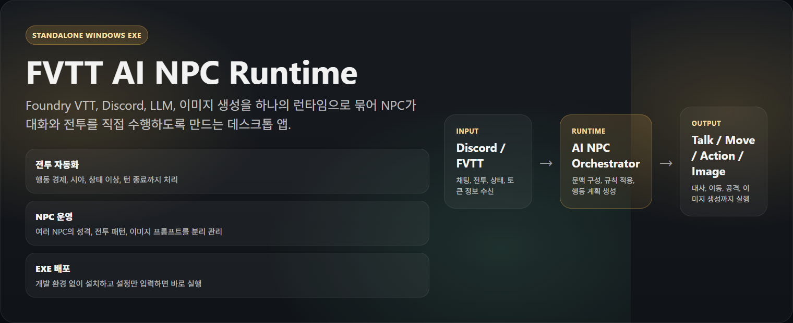

# FVTT AI NPC Runtime

FVTT 전투, Discord 대화, 소셜 연기를 하나의 Windows 데스크톱 런타임으로 묶어 주는 앱입니다.
소스코드 세팅 없이 `exe`만 받아 실행하는 DM/GM을 기준으로 설계되었습니다.



## 문서 바로가기

- 출시용 런치 킷: `docs/release/LAUNCH_KIT_KR.md`
- 5분 실행 가이드: `QUICKSTART_KR.md`
- 배포 체크리스트: `RELEASE_GUIDE_KR.md`
- 변경 내역: `CHANGELOG.md`
- 내부 설계 메모: `Spec.md`

## 개요

`FVTT AI NPC Runtime`은 Foundry VTT, Discord, LLM을 하나의 데스크톱 앱으로 연결해서 NPC가 아래 일을 직접 처리하도록 돕습니다.

- Discord에서 NPC 말투와 개성에 맞는 응답 생성
- FVTT 전투 중 자기 턴이 오면 상황을 읽고 행동 결정
- 이동, 행동, 보조 행동, 짧은 대사를 순서대로 실행
- 소셜 디렉터가 비전투 장면에서 대화 순서와 후속 화자를 짧게 조율
- 앰비언트 채터가 플레이어 주변 NPC의 일상 대화를 약하게 유지
- `@NPC 이름:` 형식의 월드 상태 메모를 장면 프롬프트에 반영
- 맵별 Scene Preset을 불러와 연기 준비를 한 번에 교체
- 여러 FVTT 세션을 연결해 NPC별 소유권이나 결석 플레이어 대행을 라우팅

즉, GM이 직접 모든 NPC를 손으로 조작하지 않아도, 설정된 NPC들이 더 일관되고 설득력 있게 반응하고 전투를 수행하게 만드는 도구입니다.

## 왜 이 프로그램이 필요한가

### 1. 다수 NPC 운영 부담 감소
전투에 NPC가 많아질수록 GM은 이동, 타겟 선정, 상태이상 확인, 대사 처리까지 동시에 관리해야 합니다. 이 런타임은 각 NPC의 설정과 현재 전투 상태를 읽어 자동으로 턴을 진행하므로 반복 업무를 크게 줄여 줍니다.

### 2. 비전투 장면도 살아 있게 유지
플레이어가 말을 걸 때만 NPC가 반응하면 마을이나 여관이 정지된 배경처럼 보이기 쉽습니다. `소셜 연기` 탭의 Director와 Ambient를 활용하면, 플레이어 근처 NPC들이 짧게 일상 대화를 이어 가거나 서로 반응하는 장면을 만들 수 있습니다.

### 3. 맵 전환 준비를 빠르게 재사용
Scene Preset을 쓰면 특정 맵용 디렉터 설정, 앰비언트 설정, `@NPC` 월드 상태, NPC별 소셜 override를 한 묶음으로 저장하고 다시 불러올 수 있습니다. 세션 시작 전에 마을, 성당, 길드홀 같은 장면을 빠르게 준비하기 좋습니다.

### 4. 결석 플레이어 대행과 여러 소유권 대응
여러 FVTT 세션을 등록해 두면 NPC마다 어느 세션으로 행동할지 분리할 수 있습니다. 오늘 못 온 플레이어 캐릭터를 임시 봇으로 돌리거나, NPC/하인/동행자를 다른 FVTT 계정 기준으로 운영할 때 유용합니다.

### 5. NPC 개성 유지
NPC마다 별도의 Soul 문서, Battle 문서, Relations/Memory 문서를 붙일 수 있어 단순 챗봇이 아니라 특정 캐릭터처럼 반응하게 만들 수 있습니다.

## 주요 기능

- `EXE 실행만으로 사용 가능`: Node 설치 없이 데스크톱 앱으로 실행
- `Quick Setup`: Discord, FVTT, LLM 연결 정보를 한 화면에서 설정
- `Codex Login`: ChatGPT 구독 기반 Codex CLI 로그인 지원
- `Diagnostics`: 시작 전에 Discord, FVTT, LLM 연결 상태 점검
- `소셜 연기 탭`: Director / Ambient를 별도 on/off로 관리
- `World Activity 메모`: `@NPC 이름: doing something` 형식으로 장면 준비
- `Scene Preset`: 맵별 연기 설정 저장, 적용, Export, Import
- `다중 FVTT 세션`: `Default FVTT Session ID`와 `Extra FVTT Sessions` 지원
- `NPC 설정 탭`: NPC별 문서, 토큰, 반응 범위, 소셜 weight, ownership 관리
- `Markdown 편집기`: 앱 내부에서 월드 문서/NPC 문서 바로 수정
- `전투 자동화`: 자기 턴에 행동 세트 구성 후 순차 실행, 완료 시 턴 종료
- `상태 기반 판단`: HP, 집중, 효과, 전투 참가 여부, 사망 유사 상태 반영
- `전술 1차 반영`: 시야, 벽, 경로 가능 여부를 고려한 타겟팅/이동
- `로그/진단 출력`: 어떤 설정이 잘못되었는지 확인 가능
- `선택형 이미지 연동`: Stable Diffusion WebUI URL을 연결하면 NPC 이미지 생성 파이프라인 확장 가능

## 스크린샷

### 메인 대시보드


이 화면에서 다음 작업을 처리합니다.

- 런타임 시작/중지
- 진단 실행
- Codex 로그인
- Discord / FVTT / LLM / 이미지 생성 기본 설정
- 기본 FVTT 세션과 추가 세션 JSON 입력
- 현재 설정 파일 위치와 앱 버전 확인
- 로그와 진단 결과 확인

### NPC 설정 패널


NPC 탭에서는 다음을 관리할 수 있습니다.

- NPC 추가/삭제
- 토큰 썸네일 확인
- 접힘/펼침 카드 UI로 NPC를 빠르게 식별
- 공용 월드 문서 연결
- NPC별 Soul / Battle / Relations / Memory 문서 설정
- NPC별 FVTT Ownership / Session 지정
- Director override와 social weight 조정
- 토큰 새로고침과 개별 저장
- 카드 헤더에서 이름, 체력 상태, 집중/이상상태, 전투 참여 여부를 빠르게 확인

## 소셜 연기 탭으로 할 수 있는 것

`소셜 연기` 탭은 비전투 장면 준비용 화면입니다.

### Director

- `Enable social director`: 디렉터 기반 순서 조율 사용
- `Director Mode`: `Off / Nearby / Directed`
- `Allow ambient daily talk`: 디렉터가 고른 NPC에게 생활 대사 허용
- `Allow NPC-to-NPC talk`: NPC끼리 짧은 후속 대화 허용
- `Player Nearby Distance`, `Max NPC-only Chain Turns`, `Max Participants`
- `NPC Cooldown`, `Scene Cooldown`, `Token Budget / Window`
- `Director Prompt File`과 인라인 addendum

### Ambient Chatter

- Director follow-up과 별개로 on/off 가능
- 별도 Ambient Prompt File / Prompt Text 관리
- 플레이어 근처 장면에서 짧은 idle 대사 유도

### World Activity

`Current World Setup`에 아래처럼 적어 두면 장면 준비를 프롬프트에 반영합니다.

```text
@Barkeep: polishing mugs and listening for rumors
@Town Guard: checking the door and watching late arrivals
The tavern is tense after sundown.
```

- `@NPC 이름:`으로 시작하는 줄은 해당 NPC의 현재 행동으로 해석
- 일반 문장은 장면 전체 분위기/상황 설명으로 공유

### Scene Preset

아래 정보를 한 묶음으로 저장하고 다시 불러올 수 있습니다.

- Director 설정
- Ambient 설정
- World Activity 텍스트
- NPC별 social override
- Scene ID 또는 Scene Name 기준 자동 매칭 정보

대표 사용 흐름:

1. `소셜 연기` 탭에서 장면 준비
2. `Capture Current`로 preset 저장
3. `Export Preset`으로 JSON 백업
4. 다른 맵 준비 시 `Import Preset` 또는 `Apply Preset`
5. 실제 런타임에서는 Scene ID 우선, Scene Name 차선으로 자동 적용

## 전투와 소셜이 함께 돌아가는 방식

이 런타임은 비전투 대사를 "진짜 동시 재생"으로 처리하지 않고, 짧은 지연을 둔 순차 처리로 운용합니다. 이유는 아래와 같습니다.

- FVTT actor selector와 세션 상태 충돌 방지
- 무한 대화 루프 방지
- 토큰/호출 비용 관리
- 로그와 디버깅 추적 단순화

즉, 체감상 동시에 말하는 것처럼 보이게 만들되 내부 실행은 안전하게 직렬화하는 방향입니다.

## 실행 전 준비물

앱을 실제로 사용하려면 아래 정보가 필요합니다.

1. `FVTT 접속 정보`
   - Foundry VTT URL
   - Foundry 계정 ID/비밀번호
2. `Discord 봇 정보`
   - Discord Bot Token
   - NPC가 반응할 채널 이름
3. `LLM 연결 정보`
   - 권장: `Codex CLI (ChatGPT subscription)`
   - 대안: OpenAI OAuth 또는 API Key
4. `선택 사항`
   - Stable Diffusion WebUI URL
   - NPC별 세계관/소울/전투 규칙 Markdown 문서
   - 추가 FVTT 세션 JSON
   - 맵별 social preset JSON

## 빠른 시작

### 1. 프로그램 설치 및 실행
배포받은 설치형 EXE를 실행해 앱을 설치한 뒤 프로그램을 실행합니다.

### 2. Quick Setup 입력
`기본 설정 > Runtime` 탭에서 아래 항목을 채웁니다.

- `Discord Bot Token`
- `Discord Channel`
- `FVTT URL`
- `FVTT Username`
- `FVTT Password`
- `Default FVTT Session ID`
- 필요 시 `Extra FVTT Sessions (JSON array)`
- `LLM Provider`
- 필요 시 `OpenAI API Key` 또는 `Codex CLI Path`

권장 설정:

- 첫 실행에서는 `Install Prerequisites`를 먼저 한 번 실행
- `LLM Provider`는 가능하면 `Codex CLI (ChatGPT subscription)` 사용
- 추적 로그가 필요하면 `Enable full trace log` 체크

### 3. NPC 설정
`NPC 설정` 탭에서 최소한 아래 항목을 연결합니다.

- 표시 이름
- Foundry Actor
- Shared World Lore File
- NPC Soul / Battle Rule 문서
- React Distance
- 필요 시 `FVTT Ownership / Session`

### 4. 소셜 장면 준비
`소셜 연기` 탭에서 아래를 준비합니다.

- Director on/off
- Ambient on/off
- Director / Ambient 프롬프트 파일
- `Current World Setup`
- Scene Preset 캡처 또는 Import

### 5. 로그인과 진단
Codex CLI를 쓰는 경우 `Codex Login` 버튼을 누르고, `Diagnostics`로 Discord / FVTT / LLM 상태를 확인합니다.

### 6. Start
`Start` 버튼을 누르면 런타임이 Discord, FVTT, LLM 연결을 시도하고 실제 동작을 시작합니다.

## 권장 운영 흐름

1. 앱 실행
2. Quick Setup 입력
3. Codex Login 또는 OpenAI 인증
4. Diagnostics 실행
5. NPC 설정 탭에서 NPC별 문서와 ownership 정리
6. 소셜 연기 탭에서 현재 맵 preset 적용
7. Start
8. 이후 Discord 대화, 비전투 장면, FVTT 전투를 런타임이 연결해 처리

## 맵별 준비를 Import/Export로 관리하는 방법

1. 여관, 시장, 길드홀처럼 자주 쓰는 씬마다 preset 하나를 준비합니다.
2. `Scene ID Match`가 안정적이면 ID를 우선 사용하고, 아니면 `Scene Name Match`를 넣습니다.
3. `Capture Current`로 preset에 현재 소셜 세팅을 덮어씁니다.
4. `Export Preset`으로 JSON을 별도 저장합니다.
5. 다음 세션이나 다른 월드에서는 `Import Preset`으로 불러옵니다.

이 방식이면 "그 맵에서 누가 뭘 하고 있고, 어떤 톤으로 대화해야 하는지"를 한 번에 불러올 수 있습니다.

## 문제 해결 체크리스트

### 1. Start가 되지 않을 때

- 설정을 저장했는지 확인
- `Diagnostics`를 먼저 실행했는지 확인
- FVTT URL, 계정, 비밀번호가 정확한지 확인
- Discord Bot Token과 Channel 이름이 맞는지 확인
- Codex 로그인 상태가 완료되었는지 확인

### 2. 소셜 연기가 기대대로 안 나올 때

- `Enable social director`와 `Enable ambient chatter`가 각각 켜져 있는지 확인
- `Director Mode`가 `Off`로 남아 있지 않은지 확인
- `Current World Setup` 문법이 `@NPC 이름: 내용` 형식인지 확인
- preset을 가져왔다면 `Apply Preset` 또는 자동 scene match가 적용됐는지 확인
- NPC 카드의 director override가 글로벌 설정을 덮어쓰고 있지 않은지 확인

### 3. 다중 FVTT 세션이 안 맞을 때

- `Default FVTT Session ID`가 비어 있지 않은지 확인
- `Extra FVTT Sessions` JSON에 `id`, `username`, `password`가 맞는지 확인
- NPC 카드의 `FVTT Ownership / Session` 값이 존재하는 세션을 가리키는지 확인
- 결석 플레이어용 세션이라면 해당 Foundry 계정에 실제 Owner 권한이 있는지 확인

### 4. NPC 토큰이 안 보일 때

- `Start` 후 토큰 동기화가 완료되었는지 확인
- `Refresh Tokens` 버튼 실행
- NPC Actor 연결이 올바른지 확인
- Foundry Scene에 실제 토큰이 배치되어 있는지 확인

### 5. 전투 판단이 기대와 다를 때

- NPC별 Battle Rule Markdown 확인
- 공용 World Lore 문서 확인
- 로그와 진단 출력 확인
- 필요 시 `Enable full trace log`를 켜고 실제 입력/출력 흐름을 점검

### 6. 보안 관련 주의

현재 설정 파일에는 민감 정보가 저장될 수 있으므로, 이 앱은 개인 PC 또는 신뢰 가능한 운영 환경에서 사용하는 것이 좋습니다.

## 배포 시 같이 안내하면 좋은 파일

- 설치형 EXE
- 기본 설정 예시 파일
- NPC 문서 예시 (`world.md`, `npc-soul.md`, `npc-battle.md`)
- social preset 예시 JSON
- 이 README
- 스크린샷 이미지 파일

## 한 줄 요약

`FVTT AI NPC Runtime`은 **FVTT 전투 상태, Discord 대화, 비전투 소셜 장면을 함께 읽고 실제 세션 운영에 맞게 NPC를 자동화하는 데스크톱 런타임**입니다.
